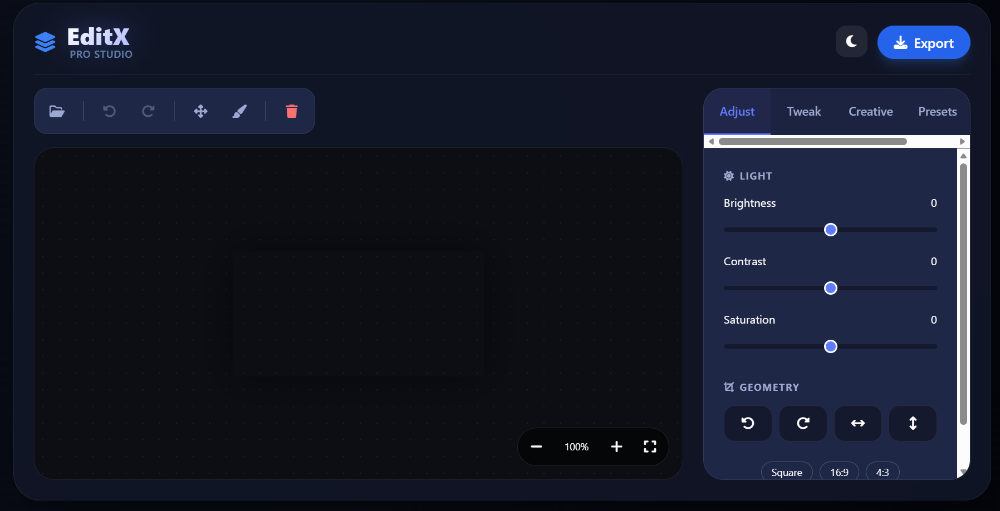
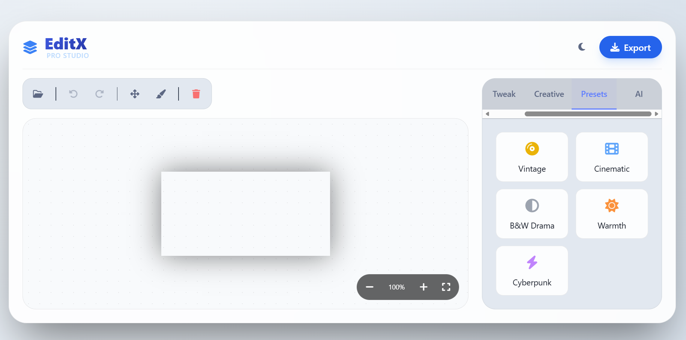

# ✨ EditX Pro Studio by Kriztech ✨

### The Ultimate AI-Powered Web Image Editor

  <a href="https://altkriz.github.io/editx/"><strong>Live Demo</strong></a> •
  <a href="#features">Features</a> •
  <a href="#screenshots">Screenshots</a>

---

## 📖 About

**EditX** is a powerful, privacy-focused image editor that runs entirely in your browser. Built with modern web technologies, it offers a distinct advantage: **Local Processing**. Your images never leave your device, ensuring maximum privacy and speed.

From quick touch-ups to complex creative compositions, EditX provides a suite of professional tools wrapped in a stunning, responsive interface.

## 📸 Interface

  <table>
    <tr>
      <td align="center"><strong>Light Mode</strong></td>
      <td align="center"><strong>Dark Mode</strong></td>
    </tr>
    <tr>
      <td align="center"></td>
      <td align="center"></td>
    </tr>
  </table>

## 🎨 Key Features

### **1. Creative Studio**

- ✏️ **Text Overlay**: Add professional typography with custom fonts (Inter, Serif, Cursive, Mono), colors, and adjustable sizing.
- 🖌️ **Freehand Brush**: Draw and annotate directly on your images with adjustable brush size and color.
- 🖼️ **Stickers & Overlays**: Upload and layer images (logos, watermarks, stickers) on top of your base photo.

### **2. Advanced Adjustments**

- 🎛️ **Professional Grading**: Fine-tune Brightness, Contrast, Saturation, and Blur.
- � **RGB Channel Mixer**: Adjust Red, Green, and Blue channels independently for color correction or artistic effects.
- 🌑 **Vignette & Grain**: Add film-like atmosphere with customizable vignette intensity and noise generation.
- � **Geometry**: Rotate, Flip Horizontal/Vertical, and Crop (Square, 16:9, 4:3) with ease.

### **3. One-Click Presets**

Instantly transform the mood of your photos with our curated filters:

- 📀 **Vintage**: Classic retro look.
- 🎬 **Cinematic**: Moody, film-inspired grading.
- � **B&W Drama**: High-contrast black and white.
- ☀️ **Warmth**: Golden hour vibes.
- ⚡ **Cyberpunk**: Futuristic neon aesthetic.

### **4. AI Magic**

- 🧙‍♂️ **Background Removal**: Remove backgrounds instantly using local AI (MediaPipe).
- 🎨 **Smart Backgrounds**: Choose between a transparent background or fill with a solid custom color using the integrated color picker.

### **5. Pro Workflow**

- 🖱️ **Zoom & Pan**: Navigate large images effortlessly with mouse wheel zoom and click-to-drag panning.
- � **Advanced Export**: Save as **PNG, JPG, or WEBP** with custom quality settings (10-100%).
- ↩️ **History**: Robust Undo/Redo system that tracks every change, including presets and AI edits.
- 🌗 **Theming**: Toggle between a crisp Light Mode and a sleek Dark Mode.

## 💻 Tech Stack

- **Core**: HTML5, Vanilla JavaScript (ES6+)
- **Styling**: TailwindCSS, FontAwesome 6
- **AI Engine**: MediaPipe Selfie Segmentation
- **Architecture**: Single Page Application (SPA), Client-Side Rendering

---

### Built with ❤️ by [Kriztech](https://kriztech.in)

© 2024 EditX. All rights reserved.

